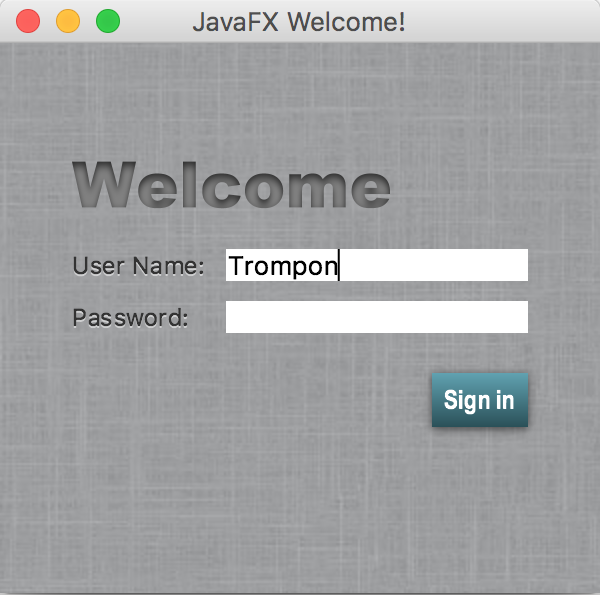

# JavaFX Samples for Ceylon

The project contains some of the [JavaFX Samples][] ported 
to the [Ceylon language][].

[Ceylon language]: http://ceylon-lang.org
[JavaFX Samples]: https://docs.oracle.com/javase/8/javafx/get-started-tutorial/get_start_apps.htm

## Requirements

This project requires Ceylon 1.3.2 and Java 8. 

- You *do not* need to install Ceylon if you don't already 
  have it installed. The `ceylonb` command is self-installing.
- If you *do* already have Ceylon 1.3.2 installed, you can 
  type `ceylon` instead of `./ceylonb` in the following 
  instructions.

To play with the samples in an IDE, you'll need to install
[Ceylon IDE for IntelliJ][] or [Ceylon IDE for Eclipse][].

[Ceylon IDE for IntelliJ]: https://ceylon-lang.org/documentation/1.3/ide/intellij/
[Ceylon IDE for Eclipse]: https://ceylon-lang.org/documentation/1.3/ide/eclipse/

## Compiling the examples

To compile the examples, type:

    ./ceylonb compile

Or, simply open the project in IntelliJ or in Eclipse.

## Running an example

To run an example, type:

    ./ceylonb run example.javafx.xxxx

where `example.javafx.xxxx` is the module name of the example 
you wish to run.

Alternatively:

- go to the example's `run()` method in IntelliJ and 'Run' 
  it, or 
- select the example's `run()` method in Eclipse and 
  'Run As > Ceylon Java Application'.

## Assembling and running a fat jar

To assemble a "fat" jar, type:

    ./ceylonb fat-jar example.javafx.xxxx

Then run it using:

    java -jar example.javafx.xxxx-1.0.0.jar

Alternatively: 

- open the example's module descriptor in IntelliJ, and 
  'Run ... with fat-jar', or
- select the example's `run()` method in Eclipse and 
  'Run As > Ceylon Java Application Packaged As Fat Jar'.

## Assembling and running a Ceylon assembly

To assemble a Ceylon assembly archive, type:

    ./ceylonb assemble example.javafx.xxxx

Then run it using:

    ./ceylonb run --assembly example.javafx.xxxx-1.0.0.cas
